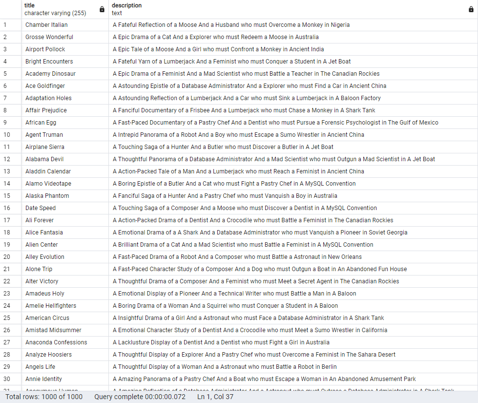
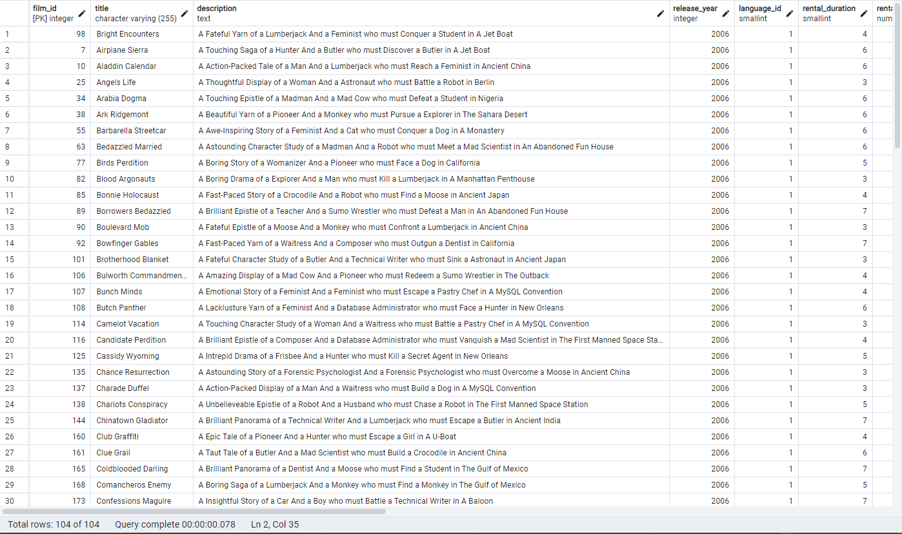
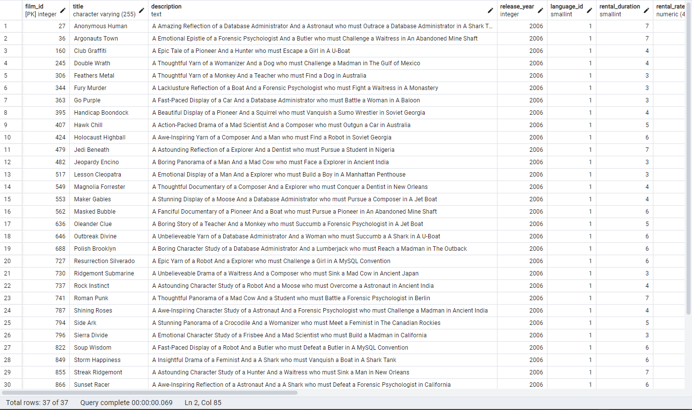
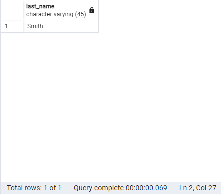
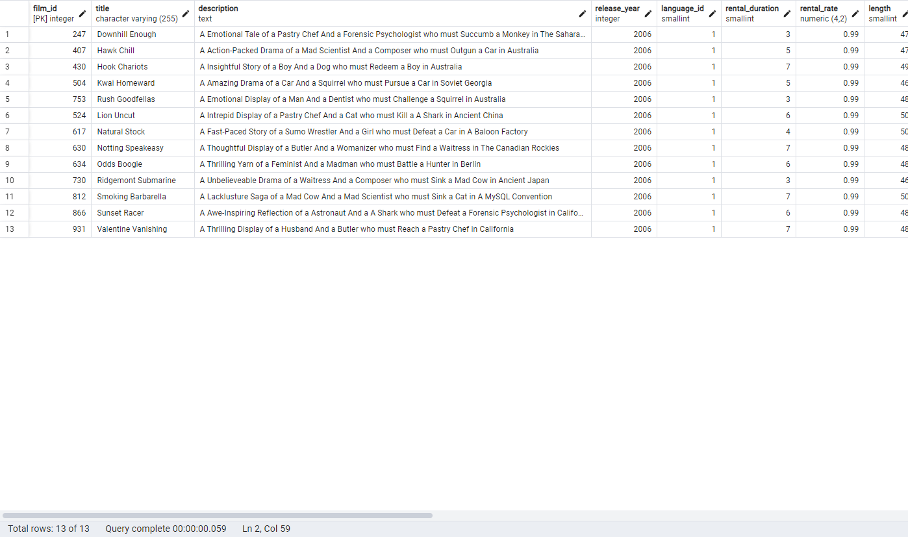

## 1. Retrieve the `title` and `description` columns from the `film` table.

### Query:
```sql
SELECT title, description FROM film;
````

### Explanation:
This query retrieves the title and description of all films from the film table. It is useful for displaying basic information about the available films in the database.

### Result:
 
## 2. Retrieve all columns from the film table where the film length is greater than 60 and less than 75.
### Query:
```sql
SELECT * FROM film
WHERE length > 60 AND length < 75;
````
### Explanation:
This query retrieves all films where the length is between 60 and 75 minutes. It filters the films based on their duration.

### Result:
 
 
## 3. Retrieve all columns from the film table where rental_rate is 0.99 and replacement_cost is either 12.99 or 28.99.
### Query:
```sql
SELECT * FROM film
WHERE rental_rate = 0.99 AND (replacement_cost = 12.99 OR replacement_cost = 28.99);
````
### Explanation:
This query filters films based on two conditions: the rental_rate must be 0.99 and the replacement_cost must be either 12.99 or 28.99.

### Result:
 
 
## 4. Retrieve the last_name of the customer where the first_name is 'Mary'.
### Query:
````sql
SELECT last_name FROM customer
WHERE first_name = 'Mary';
````
### Explanation:
This query looks for customers whose first_name is 'Mary' and retrieves their last_name.

### Result:
 
 
## 5. Retrieve records from the film table where the length is not greater than 50 and rental_rate is neither 2.99 nor 4.99.
### Query:
```sql
SELECT * FROM film
WHERE NOT length > 50 AND rental_rate NOT IN (2.99, 4.99);
````
### Explanation:
This query retrieves films where the length is 50 minutes or less and excludes those where the rental_rate is 2.99 or 4.99.

### Result:
 
 
### Conclusion
These SQL queries demonstrate the use of the WHERE clause with various conditions and logical operators to retrieve and filter specific records from the `dvdrental` database.
