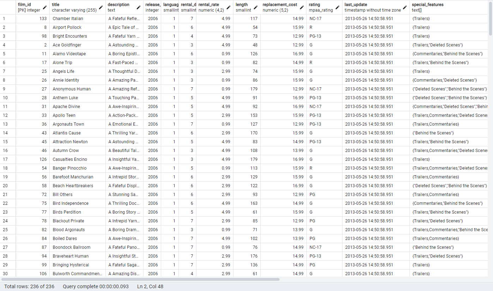
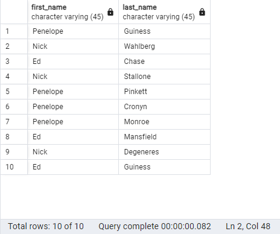
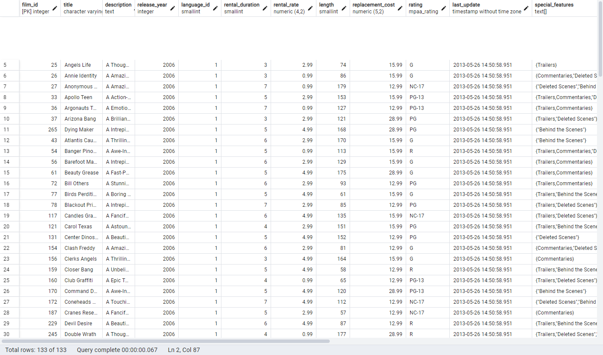

## 1. Retrieve all columns from the `film` table where the `replacement_cost` is greater than or equal to 12.99 and less than 16.99 (using `BETWEEN - AND`).

### Query:
```sql
SELECT * FROM film
WHERE replacement_cost BETWEEN 12.99 AND 16.99;
````

### Explanation:
This query retrieves all films where the replacement_cost is between 12.99 and 16.99, inclusive of 12.99 but exclusive of 16.99. The BETWEEN - AND operator is used to filter the films based on their replacement_cost.

### Result:
 
## 2. Retrieve the first_name and last_name columns from the actor table where the first_name is 'Penelope', 'Nick', or 'Ed' (using IN operator).
### Query:
```sql
SELECT * FROM film
WHERE length > 60 AND length < 75;
````
### Explanation:
This query retrieves actors whose first_name is either 'Penelope', 'Nick', or 'Ed'. The IN operator is used to check for multiple values in the first_name column.

### Result:
 
 
## 3. Retrieve all columns from the film table where the rental_rate is 0.99, 2.99, or 4.99 AND the replacement_cost is 12.99, 15.99, or 28.99 (using IN operator).
### Query:
```sql
SELECT * FROM film
WHERE rental_rate IN (0.99, 2.99, 4.99)
AND replacement_cost IN (12.99, 15.99, 28.99);

````
### Explanation:
This query retrieves films where the rental_rate is 0.99, 2.99, or 4.99 and the replacement_cost is 12.99, 15.99, or 28.99. The IN operator is used to check for multiple values in both the rental_rate and replacement_cost columns.

### Result:
 

### Conclusion
These SQL queries demonstrate the use of the WHERE clause with BETWEEN - AND and IN operators to filter specific records from the dvdrental database.
